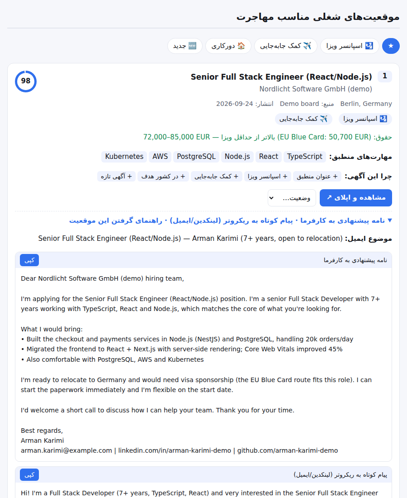

<div align="center">

# jobreferrer

**Upload your resume → get visa-sponsored and relocation jobs abroad, freelance gigs, a tailored pitch for every employer and a step-by-step immigration plan.**

[](https://github.com/masterkasra/jobreferrer/actions/workflows/ci.yml)
[](LICENSE)

[فارسی](README.fa.md) · [Sample report](examples/sample-report.md) · [Competitor analysis](docs/competitors.md)



</div>

## What it does

1. **Reads your resume in any common format**: PDF, Word (DOCX and legacy DOC), ODT, RTF, HTML, TXT/MD, JSON Resume, and photos or scans (JPG/PNG/WEBP, scanned PDF). English and **Persian** resumes are both supported (Persian digits, Jalali dates and job titles are understood). Without an API key a built-in parser extracts titles, skills, years, languages, degree and achievements; with a Claude key, Claude reads the resume directly and also transcribes photos and scans.
2. **Searches 15 job sources in parallel**, including the career pages of ~27 companies that hire internationally (GitLab, Canonical, N26, GetYourGuide, Adyen, Spotify, Stripe…, via their public Greenhouse/Lever/Ashby feeds), and generates ready-made searches for 40+ more (LinkedIn, Indeed in 31 countries, StepStone, XING, SEEK, Bayt, Relocate.me, Jaabz, EURES…).
3. **Ranks every job precisely**: weighted skill match, title and field, *years of experience and seniority the ad asks for*, visa sponsorship, relocation help, target country, required local language, freshness. Each card explains *why* it was ranked (and what counts against it).
4. **Two tracks**: jobs to **move** for (sponsorship, relocation, target countries) and **remote jobs you can do from where you live**. Remote eligibility is checked against your country of residence (worldwide / EMEA / Europe-only / one-country / US-hours) and ads that exclude sanctioned countries are pushed down.
5. **Personal immigration assessment**, like a first consultation with an immigration adviser: official points systems (Canada CRS + FSW 67-point grid, Germany Opportunity Card, Australia points test) with "what if" levers (e.g. IELTS CLB 9 → +53 CRS), every route in your target countries rated strong / possible / hard / closed with next steps, costs and timelines, a document checklist (with Iran-specific items: degree release, official translation, military service, where to give biometrics), a 90-day plan and links to licensed advisers.
6. **Checks each job's visa side**: the employer against the official UK / Netherlands sponsor registers, and the advertised salary against the 2026 visa threshold (EU Blue Card, kennismigrant, Skilled Worker, Critical Skills, Sweden work permit).
7. **Writes application material** for the top relocation and remote jobs (different wording for each track): cover letter, short recruiter message, email subject, missing keywords, how to win this job, and likely interview questions.
8. **Lists freelance projects** with a ready proposal, plus freelance platforms to use while the job search runs.
9. **Builds your strategy**: best countries and visa routes for your profile, resume and LinkedIn fixes, freelance pricing, a 4-week action plan, scam and nationality-specific warnings.
10. **Delivers it** as a self-contained HTML report (Persian RTL or English, with an application tracker and document checklist saved in the browser), Markdown, JSON, a Telegram bot, a local web page, or a daily Telegram digest from GitHub Actions.

## Job sources

| Source | Key | Notes |
|---|---|---|
| Company career pages | free | ~27 employers known for international hiring, read from their public Greenhouse / Lever / Ashby feeds |
| Arbeitnow | free | Germany/EU, explicit visa-sponsorship flag |
| Bundesagentur für Arbeit | free | German federal job board (only when DE is a target) |
| Remotive, Remote OK, Jobicy, Himalayas, Working Nomads, We Work Remotely | free | Remote jobs; region-locked roles are penalised |
| The Muse | free | Jobs in target cities |
| HN "Who is hiring" | free | Posts that mention VISA / RELOCATION |
| Freelancer.com | free | Live freelance projects |
| Adzuna | free key | National boards in 19 countries, filtered for visa/sponsor/relocation |
| Jooble | free key | 70+ countries |
| Reed | free key | UK |

`jobreferrer --list-sources` shows them all. Any failing source is reported and skipped; the rest of the run continues.

## Quick start

Requires Node.js 20+.

```bash
git clone https://github.com/masterkasra/jobreferrer.git
cd jobreferrer
npm install

# Try it with demo data (no network, no keys)
npm run demo            # → examples/sample-report.html

# Real search
node bin/jobreferrer.js my-resume.pdf --countries DE,NL,GB,IE,CA --nationality IR --lang fa
```

Optional: copy `.env.example` to `.env` and add `ANTHROPIC_API_KEY` for Claude-written letters and strategy (default model `claude-opus-5`), and the free Adzuna / Jooble / Reed keys for more coverage.

### CLI options

```
-c, --countries DE,NL,GB   target countries (ISO codes)
-l, --lang fa|en           report language
-n, --nationality IR       passport country → nationality-specific warnings
-o, --out reports/report   output path without extension
-f, --format html,md,json
    --top 25 / --pitches 10
    --title "Data Engineer"  force the job title to search for
    --only a,b / --skip a,b  pick sources
    --no-ai                  never call Claude
    --offline                demo data instead of live search
    --seen FILE              remember jobs and flag new ones
    --telegram [--only-new]  send the result to TELEGRAM_CHAT_ID
Immigration assessment (optional, makes the calculators exact):
    --age 31 --married --residence IR --education master
    --ielts 8,7,7,7          IELTS General bands L,R,W,S (or one overall score)
    --german B1 --french A2
```

## Telegram bot

1. Create a bot with [@BotFather](https://t.me/BotFather) and put the token in `.env` as `TELEGRAM_BOT_TOKEN`.
2. `npm run bot` (or `docker build -t jobreferrer . && docker run -d --env-file .env -v jr:/app/.cache jobreferrer`).
3. Send the bot your resume. It replies with ranked jobs, a button per job for the full application kit, and the HTML report.

Commands: `/countries DE NL GB`, `/nationality IR`, `/title …`, `/lang fa|en`, `/jobs`, `/daily` (daily digest of new jobs), `/settings`, `/forget`.
Set `TELEGRAM_ALLOWED_USERS` to limit who can use your bot (it spends your API credits).

## Daily digest with GitHub Actions (no server)

The [`daily-digest`](.github/workflows/daily-digest.yml) workflow runs every morning and sends only jobs you have not seen before.

1. Repository → Settings → Secrets and variables → Actions.
2. Secrets: `TELEGRAM_BOT_TOKEN`, `TELEGRAM_CHAT_ID`, `RESUME_B64` (`base64 -w0 resume.pdf`) or `RESUME_TEXT`, optionally `ANTHROPIC_API_KEY` and job-board keys.
3. Variables: `DIGEST_ENABLED=true`, `TARGET_COUNTRIES`, `NATIONALITY`, `REPORT_LANG`, `RESUME_NAME`.

Keep the repository private if you store your resume in it.

## Web UI

Hosted: **<https://jobreferrer.vercel.app>**: upload a resume, tick countries, optionally add age / IELTS bands / German level for exact points, and get the report in the browser. Nothing is stored.

Locally: `npm run web` → <http://localhost:3000>. The same handler runs as a Vercel function (`api/index.js`, `vercel.json`).

## How ranking works

| Signal | Effect |
|---|---|
| Skills in the ad that you have (your top 8 skills count 1.5×) | up to +40 |
| Your own title in the ad title / word matches | +25 / up to +20 |
| Ad title is in an unrelated field | −20 |
| Ad title names a technology you don't have (".NET Developer" for a React developer) | −12 |
| Years asked vs yours (parsed in English, German, Dutch) | +4 / −4 / −12 |
| Level in the title vs yours (junior … director) | −3 to −12 |
| Visa sponsorship / relocation mentioned | +15 / +10 |
| In one of your target countries | +8 |
| Remote and open from where you live (worldwide / EMEA / …) | +6 to +8 |
| "No sponsorship" / "must have right to work" | −25 (−8 for remote-from-home) |
| Remote but locked to another region, or only for residents there | −12 / −6 |
| Needs US working hours (you live outside the Americas) | −6 |
| Ad excludes sanctioned countries and you live in one | −30 |
| Requires a language you don't speak at B2+ | −10 each |
| Posted in the last week / older than 60 days | +5 / −5 |
| Scam patterns (fees, guaranteed visa, WhatsApp-only) | removed and listed separately |

Near-duplicate ads are merged, and no employer takes more than 2 of the top places.

## Project layout

```
bin/jobreferrer.js        CLI
src/pipeline.js           resume → profile → search → rank → checks → pitches → strategy
src/profile/              offline parser + skill taxonomy
src/llm/claude.js         Claude: profile extraction, pitches, strategy (structured outputs)
src/sources/              14 job-source adapters, search links, cache
src/jobs/                 normalisation, visa/relocation/language/scam signals, geo
src/match/score.js        ranking
src/immigration/          country knowledge base, salary checks, sponsor registers
src/writer/, src/guidance/  offline templates and strategy
src/report/               HTML, Markdown, Telegram renderers (fa/en)
src/bot/, src/web/        Telegram bot, local web UI
```

## Development

```bash
npm test          # unit + integration tests (no network): every resume format, English + Persian, bot, web, pipeline
npm run smoke     # live check of every job source
npm run e2e       # live end to end: each resume format → real job boards → ranked jobs + reports in e2e-reports/
```

CI runs the tests on Node 20 and 22, a live check of the job boards, and the live end-to-end run (its HTML reports are uploaded as the `e2e-reports` artifact).

## Disclaimer

Immigration rules and salary thresholds change. Figures in `src/immigration/countries.js` were checked in September 2026; the report always links the official source. This is guidance, not legal advice. Respect each job board's terms; the bot only uses public APIs and feeds and links back to the original ads.

## License

MIT
